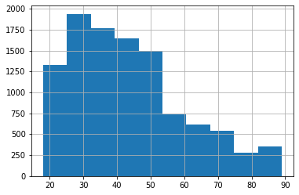
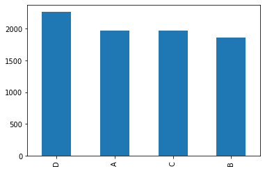

# Customer Segementation Classifier: Project Overview
* Created a tool that predict right group of new customers (Accuracy score: $0.87809$) to market the existing products.
* Data leakage is found between training data and testing data.
* Train-test split using stratified sampling technique.
* All-in-one pipeline created by combining preprocessing steps (Missing value imputation, categorical data convertion, numerical data standardization) and model training.
* Model building on Logistic Regression, Decision Tree, Random Forests, Voting Classifier and XGB Classifier.
* Optimized XGB Classifier by fine-tuning hyperparameters of preprocessing steps and model to reach the best model.

## Resources Used
**Python Version:** 3.9.6    
**Packages:** numpy, pandas, matplotlib, sklearn

## EDA (Exploratory Data Analysis)
Below are some highlights during data exploration.
* Age histogram

* Profession bar chart

* Var_1 (Anonymised customer category) bar chart

* Segmentation bar chart

## Data Preprocessing
* Split the data into 2 sets ($80\%$ training data, $20\%$ validation data)
* Testing data is provided without splitting (Acts as submission to the challenge)
* Drop **`null`** data for **`Var_1`** column
* Stratified sampling on **`Segmentation`** and **`Var_1`**
* Convert Age into categorical data with customized bins using self-defined transformer
* Use **`Simple Imputer`** with **`median`** and **`most_frequent`** strategy to impute missing values
* Use **`One Hot Encoder`** and **`Ordinal Encoder`** to encode into categorical data
* Use **`Standard Scaler`** to normalize numeric data
* Use **`Column Transformer`** to transform data

## Model Building
* Tried five different models and evaluated them using **acurracy score**. 
* Choose **accuracy score** as required in the challenge because we have to accurately predict customers in their respective group.
* Use **`Pipeline`** to combine preprocessor and model.

## Model Performance
The **XGB Classifier** model is the best compared to the others (Although not impressive result).

* **Logistic Regression** - 0.51470
* **Decision Tree** - 0.441526
* **Random Forest** - 0.47467
* **Voting Classifier** - 0.47592
* **XGB Classifier** - 0.51657

## Model Tuning
* Tune using hyperparameters tuning on **preprocessor** & **XGB Classifier**
* Final score of 0.52964 (increased by 0.13%)
* Optimized hyperparameters:

|Hyperparameter|Value|
|:-|:-|
|`preprocessor__num__imputer__strategy`|`mean`|
|`preprocessor__age__imputer__strategy`|`median`|
|`preprocessor__age__age_transformer__bins`|`[0,30,41,53,100]`|
|`xgb_cf__min_child_weight`|`1`|
|`xgb_cf__gamma`|`1`|
|`xgb_cf__subsample`|`1`|
|`xgb_cf__max_depth`|`3`|

## Final Model Performance
* Performance evaluation based on testing set (Accuracy score: 0.87809)
* Strategy: 
  * Use original labels for leakage data
  * Use model prediction for non-leakage data

