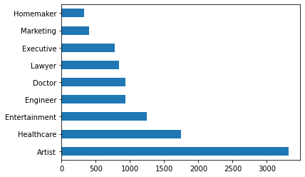

{
 "cells": [
  {
   "cell_type": "markdown",
   "id": "2bb23c82",
   "metadata": {},
   "source": [
    "# Customer Segementation Classifier: Project Overview\n",
    "* Created a tool that predict right group of new customers (Accuracy score: $0.87809$) to market the existing products.\n",
    "* Data leakage is found between training data and testing data.\n",
    "* Train-test split using stratified sampling technique.\n",
    "* All-in-one pipeline created by combining preprocessing steps (Missing value imputation, categorical data convertion, numerical data standardization) and model training.\n",
    "* Model building on Logistic Regression, Decision Tree, Random Forests, Voting Classifier and XGB Classifier.\n",
    "* Optimized XGB Classifier by fine-tuning hyperparameters of preprocessing steps and model to reach the best model.\n",
    "\n",
    "## Resources Used\n",
    "**Python Version:** 3.9.6    \n",
    "**Packages:** numpy, pandas, matplotlib, sklearn\n",
    "\n",
    "## EDA (Exploratory Data Analysis)\n",
    "Below are some highlights during data exploration.\n",
    "* Age histogram\n",
    "\n",
    "* Profession bar chart\n",
    "\n",
    "* Var_1 (Anonymised customer category) bar chart\n",
    "\n",
    "* Segmentation bar chart\n",
    "\n",
    "\n",
    "\n",
    "## Data Preprocessing\n",
    "* Split the data into 2 sets ($80\\%$ training data, $20\\%$ validation data)\n",
    "* Testing data is provided without splitting (Acts as submission to the challenge)\n",
    "* Drop **`null`** data for **`Var_1`** column\n",
    "* Stratified sampling on **`Segmentation`** and **`Var_1`**\n",
    "* Convert Age into categorical data with customized bins using self-defined transformer\n",
    "* Use **`Simple Imputer`** with **`median`** and **`most_frequent`** strategy to impute missing values\n",
    "* Use **`One Hot Encoder`** and **`Ordinal Encoder`** to encode into categorical data\n",
    "* Use **`Standard Scaler`** to normalize numeric data\n",
    "* Use **`Column Transformer`** to transform data\n",
    "\n",
    "\n",
    "## Model Building\n",
    "* Tried five different models and evaluated them using **acurracy score**. \n",
    "* Choose **accuracy score** as required in the challenge because we have to accurately predict customers in their respective group.\n",
    "* Use **`Pipeline`** to combine preprocessor and model.\n",
    "\n",
    "## Model Performance\n",
    "The **XGB Classifier** model is the best compared to the others (Although not impressive result).\n",
    "\n",
    "* **Logistic Regression** - 0.51470\n",
    "* **Decision Tree** - 0.441526\n",
    "* **Random Forest** - 0.47467\n",
    "* **Voting Classifier** - 0.47592\n",
    "* **XGB Classifier** - 0.51657\n",
    "\n",
    "## Model Tuning\n",
    "* Tune using hyperparameters tuning on **preprocessor** & **XGB Classifier**\n",
    "* Final score of 0.52964 (increased by 0.13%)\n",
    "* Optimized hyperparameters:\n",
    "|Hyperparameter|Value|\n",
    "|:-|:-|\n",
    "|`preprocessor__num__imputer__strategy`|`mean`|\n",
    "|`preprocessor__age__imputer__strategy`|`median`|\n",
    "|`preprocessor__age__age_transformer__bins`|`[0,30,41,53,100]`|\n",
    "|`xgb_cf__min_child_weight`|`1`|\n",
    "|`xgb_cf__gamma`|`1`|\n",
    "|`xgb_cf__subsample`|`1`|\n",
    "|`xgb_cf__max_depth`|`3`|\n",
    "\n",
    "\n",
    "## Final Model Performance\n",
    "* Performance evaluation based on testing set (Accuracy score: 0.87809)\n",
    "* Strategy: \n",
    "  * Use original labels for leakage data\n",
    "  * Use model prediction for non-leakage data\n",
    "\n",
    "\n"
   ]
  }
 ],
 "metadata": {
  "kernelspec": {
   "display_name": "Python 3 (ipykernel)",
   "language": "python",
   "name": "python3"
  },
  "language_info": {
   "codemirror_mode": {
    "name": "ipython",
    "version": 3
   },
   "file_extension": ".py",
   "mimetype": "text/x-python",
   "name": "python",
   "nbconvert_exporter": "python",
   "pygments_lexer": "ipython3",
   "version": "3.9.6"
  }
 },
 "nbformat": 4,
 "nbformat_minor": 5
}
